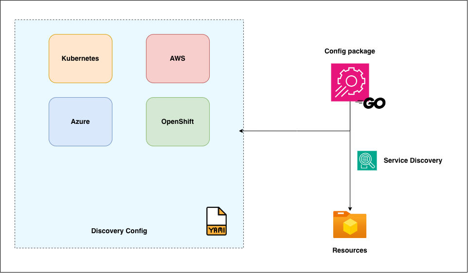

# /internal/config

`config` package is responsible for loading, parsing and validating the application configuration which the entire application depends on.
This application tries the targets for service discovery by looking into the specified sources (e.g. a Kubernetes cluster or AWS account etc.)

# Overall process flow

